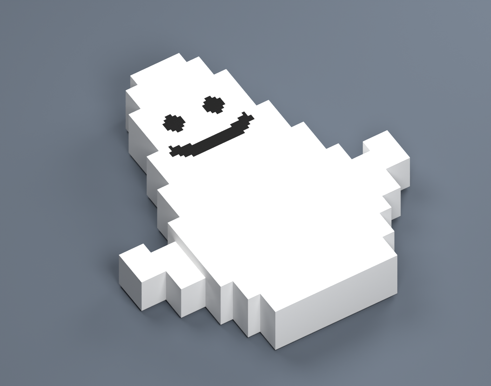

# Dyeable floor Pirkko

A **12-cube** Minecraft Java / Blockbench adaptation of the mascot shown at
[Pirkko Power](https://pirkkopower.com/), with a rounded head, broad body, raised
hands, and a simple black smile. The model lies flat with its face pointing up.

**Size:** 1½ blocks long × 1⅜ blocks wide including the hands × ¼ block tall.
The body is ⅞ block wide. Maximum height is four model units, half a normal
Minecraft slab. The underside is exactly Y = 0. The head points toward −Z in
Blockbench. All geometry uses whole units, and all cubes are at least one unit
thick, with no overlapping volumes.

## Blockbench files

- `model/pirkko.bbmodel` — white reference look and neutral dye master.
- `model/pirkko_red_preview.bbmodel` — red editing preview.
- `model/pirkko_purple_preview.bbmodel` — purple editing preview.
- `model/pirkko_cyan_preview.bbmodel` — cyan editing preview.

All projects have 12 named cuboids in three groups, an embedded 128 × 128 texture,
per-face UVs, and item display transforms. Export the neutral master for runtime
dye support; colored preview textures have their colors baked in.

## Minecraft Java assets

Target versions: **26.1 / 26.2**, matching the existing models in this workspace.

- Item model identifier: `splat:pirkko`.
- Geometry: `resourcepack/assets/splat/models/item/pirkko.json`.
- Item/tint definition: `resourcepack/assets/splat/items/pirkko.json`.
- Texture: `resourcepack/assets/splat/textures/item/pirkko_ink.png`.

Set the item's `minecraft:item_model` to `splat:pirkko`. Its
`minecraft:dyed_color` component can hold any 24-bit RGB value; the default is
white (`#FFFFFF`). Faces use `tintindex: 0` and the `minecraft:dye` tint source.
The grayscale texture has pure black facial pixels: multiplying them by any dye
color leaves them black. The rest of the body and both hands change color.

For a placed display, use `item_display: "none"`, unit scale, no rotation, and
display transformation translation `[0.0, 0.5, 0.0]`. Place the entity at the floor
surface. This accounts for Java's centered item coordinates; the model is already
horizontal. Dropped items retain Minecraft's standard bobbing behavior.

This is a rendering asset package; placement logic and collision belong to the
consuming mod/plugin. The earlier squid model remains available separately.

Reference design: Pirkko Power. This cuboid model and pixel texture are a new
adaptation for this project, not the site's downloadable STL.
